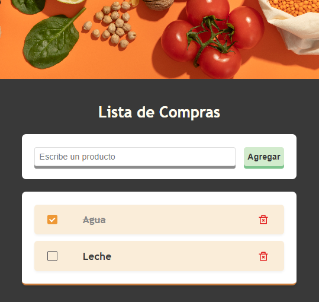

# Shopping List Component

Componente React para gestionar una lista de compras básica.

## React Hooks: `useState`

El hook `useState` es una de las herramientas más fundamentales en React para manejar el estado en componentes funcionales.

### **Propósito**:  
Administrar dos estados independientes:
1. `products`: Array de ítems (estado persistente)
2. `newProduct`: Valor temporal del input

### Flujo de Datos con Hooks

1. **Captura** → `onChange` actualiza `newProduct` (estado temporal)
2. **Submit** → `addProduct` fusiona `newProduct` con `products`
3. **Eliminación** → `deleteProduct` filtra `products`

### Características 
- **Actualización asíncrona**: Los cambios de estado no son inmediatos
- **Re-renderizado**: Cada actualización hace que el componente se vuelva a renderizar
- **Estado inicial**: Solo se evalúa en el primer render