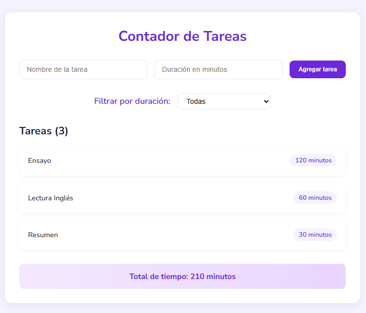

# Task Timer con React Hooks

Una aplicación para gestionar tareas, construida con **React + Vite** y diseñada para demostrar el uso de Hooks como `useState`, `useEffect` y `useMemo`. 

## Características  

- **Almacenamiento persistente**: Las tareas se guardan en `localStorage` usando `useEffect`.  
- **Optimización de rendimiento**:  
  - Filtrado de tareas con `useMemo`.  
  - Tiempo total memorizado para evitar cálculos innecesarios.  
- **Interfaz dinámica**:  
  - El título del documento se actualiza con el tiempo total.  
 
- **Sistema de filtrado**: Clasifica tareas por duración (cortas/medias/largas).  

## Hooks clave implementados  

- `useState`: Gestionar estados del formulario, tareas y filtros 
- `useEffect`: Persistencia en `localStorage` y actualización del título 
- `useMemo`: Optimizar cálculos de tareas filtradas y tiempo total 

