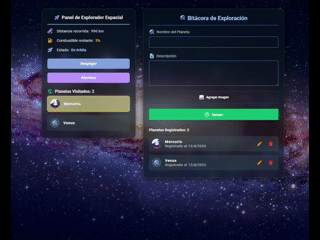

# Explorador Espacial - LifeCycle React

Un proyecto interactivo que simula la exploración de planetas, con sistema de bitácora y panel de control.

Construido con **React + Vite** y diseñada para demostrar el uso de Hooks para gestión de estado `useState`, `useEffect`, `useMemo` y `useRef`. 

## Componentes principales

### 1. Bitácora de Exploración

La bitácora permite registrar y gestionar planetas descubiertos con las siguientes funcionalidades:

- **Gestión de planetas**:
  - Añadir nuevos planetas con nombre, descripción e imagen
  - Editar planetas existentes
  - Eliminar planetas registrados

- **Visualización**:
  - Listado completo de planetas registrados
  - Vista detallada al seleccionar un planeta
  - Previsualización de imágenes subidas

### 2. Panel de Control

El panel proporciona una interfaz para controlar la nave espacial con:

- **Indicadores de estado**:
  - Nivel de combustible (se consume durante el vuelo)
  - Distancia recorrida (aumenta automáticamente)
  - Estado actual de la nave (en vuelo, aterrizando, etc.)

- **Controles de navegación**:
  - Función de aterrizaje (selecciona un planeta aleatorio de la bitácora)
  - Función de despegue (reanuda el vuelo)
  - Sistema automático de recarga de combustible

## Tecnologías utilizadas

- `Material-UI` para iconos y componentes básicos
- `localStorage` para persistencia de datos

## Consideraciones

- La aplicación funciona completamente en el navegador
- Los datos se almacenan localmente en el navegador del usuario