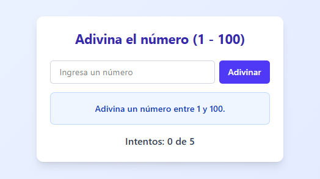

# Adivina el Número

Un juego interactivo construido con React que demuestra el uso de renderizado condicional y composición de componentes.

## Características

- Juego de adivinar un número entre 1 y 100
- Interfaz moderna utilizando **Tailwind CSS**

## Componentes Principales

- **Game**: Componente principal que gestiona el estado del juego y coordina los demás componentes.

- **InputNumber**: Input especializado para números con validación integrada.

- **Message**: Muestra mensajes condicionales según el estado del juego (éxito, error, información).

- **RestartButton**: Botón para reiniciar el juego, visible solo al terminar una partida.

